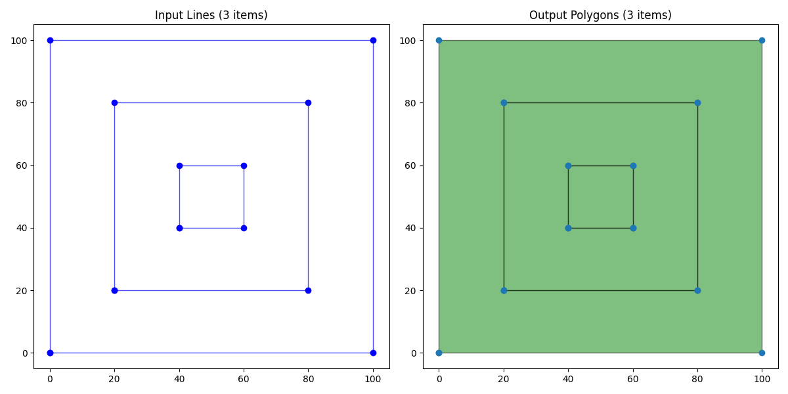
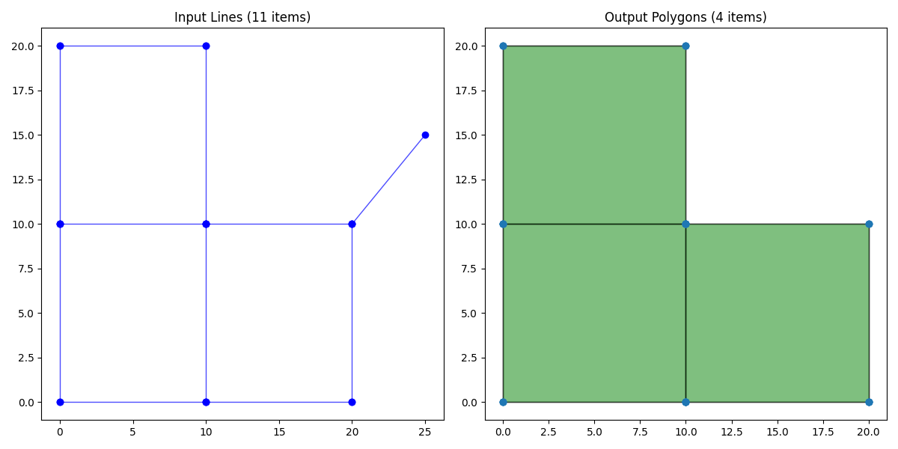
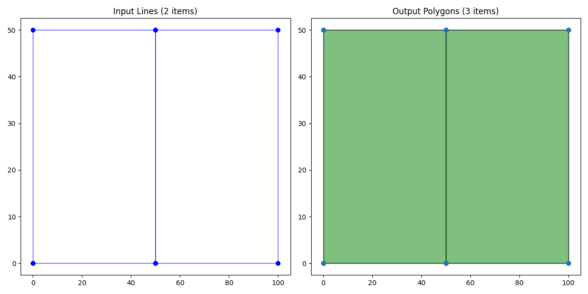
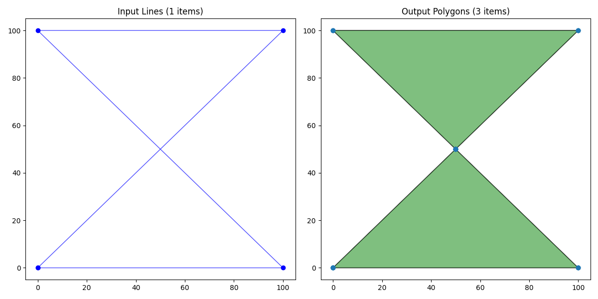

# Geo Polygonize

A native Rust port of the JTS/GEOS polygonization algorithm. This crate allows you to reconstruct valid polygons from a set of lines, including handling of complex topologies like holes, nested shells, and disconnected components.

## Features

- **Robust Polygonization**: Extracts polygons from unstructured linework.
- **Efficient Noding**: Implements an optimized R-Tree based iterative noder ($O(N \log N)$) with collinear overlap handling.
- **Performance**: Competitive with GEOS/Shapely (C++), outperforming it on random sparse inputs and scaling well on dense grids.
- **Hole Assignment**: Correctly assigns holes to their parent shells.
- **Planar Graph**: Uses an efficient arena-based index graph implementation (Structure of Arrays) for memory efficiency.
- **Geo Ecosystem**: Fully integrated with `geo-types` and `geo` crates.

## Usage

### Library

```rust
use geo_polygonize::Polygonizer;
use geo_types::LineString;

fn main() {
    let mut poly = Polygonizer::new();

    // Enable robust noding if lines might intersect
    poly.node_input = true;

    // Add lines (e.g., a square with diagonals)
    poly.add_geometry(LineString::from(vec![
        (0.0, 0.0), (10.0, 0.0), (10.0, 10.0), (0.0, 10.0), (0.0, 0.0)
    ]).into());
    poly.add_geometry(LineString::from(vec![
        (0.0, 0.0), (10.0, 10.0)
    ]).into());

    let polygons = poly.polygonize().expect("Polygonization failed");

    for p in polygons {
        println!("Found polygon with area: {}", p.unsigned_area());
    }
}
```

### CLI Example

The repository includes a CLI tool to polygonize GeoJSON files.

```bash
# Build the example
cargo build --example polygonize --release

# Run on input lines
cargo run --release --example polygonize -- --input lines.geojson --output polygons.geojson --node
```

### Visualization

You can visualize the results using the provided Python script (requires `matplotlib` and `shapely`).

```bash
python3 scripts/visualize.py --input lines.geojson --output polygons.geojson --save result.png
```

## Examples

Below are some examples of what the polygonizer can do.

### Nested Holes and Islands

The algorithm correctly identifies nested structures (Island inside a Hole inside a Shell).



### Incomplete Grid / Dangles

The algorithm prunes dangles (dead-end lines) and extracts only closed cycles.



### Touching Polygons (Shared Edges)

Using robust noding (`--node`), it can reconstruct adjacent polygons that share boundaries, even if the input lines are not perfectly noded.



### Self-Intersecting Geometry (Bowtie)

Self-intersecting lines are split at intersection points, and valid cycles are extracted.



## Benchmarks

This library includes a "severe" comparison suite against `shapely` (GEOS).

See [BENCHMARKS.md](BENCHMARKS.md) for detailed results and instructions on how to run them.

## Architecture

This implementation moves away from the pointer-based graph structures of JTS/GEOS to a Rust-idiomatic Index Graph (Arena) approach. This ensures memory safety and enables potential parallelization. Optimization efforts have focused on:
1.  **Bulk Loading**: Graph nodes are built via parallel sort/deduplication to avoid `HashMap` overhead.
2.  **Memory Layout**: Edges are stored as compact `Line` structs rather than heap-allocated `LineString`s.
3.  **Spatial Indexing**: Noding uses `rstar` for efficient intersection detection.

## License

MIT/Apache-2.0
