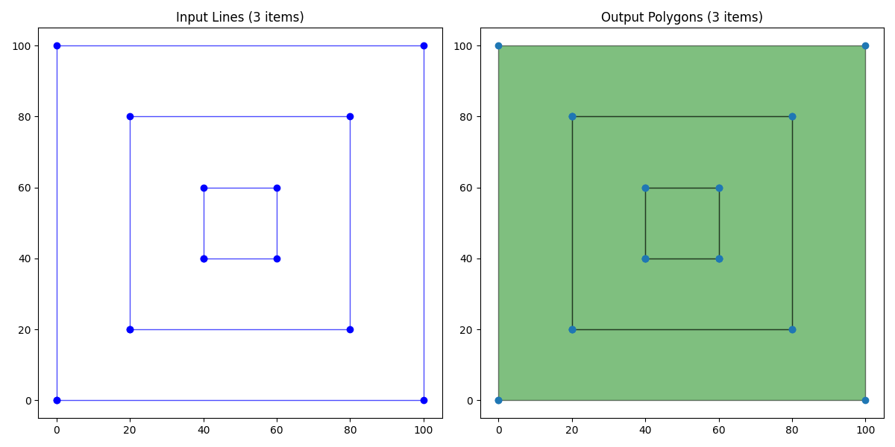
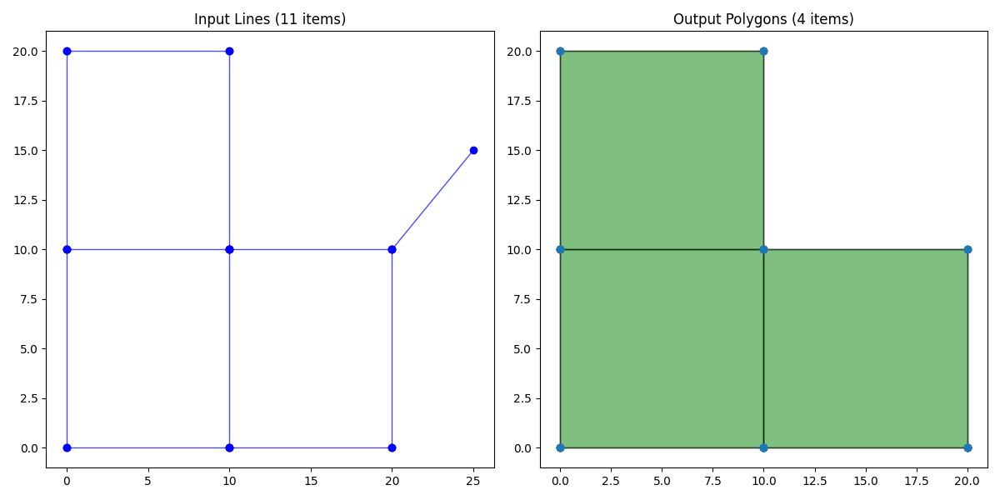
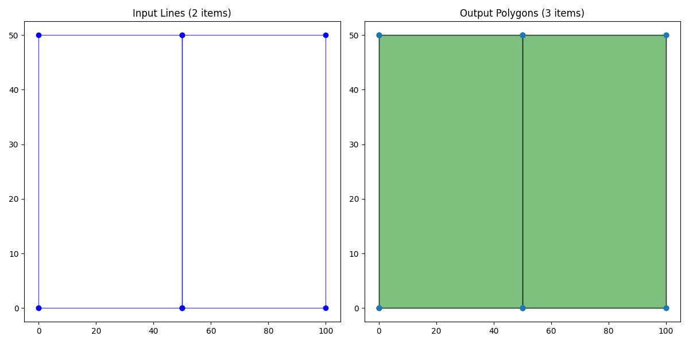
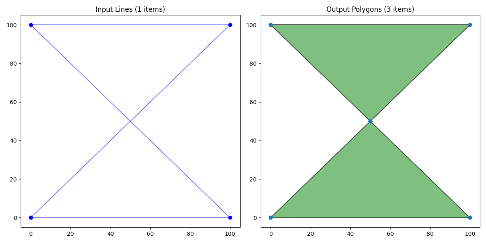
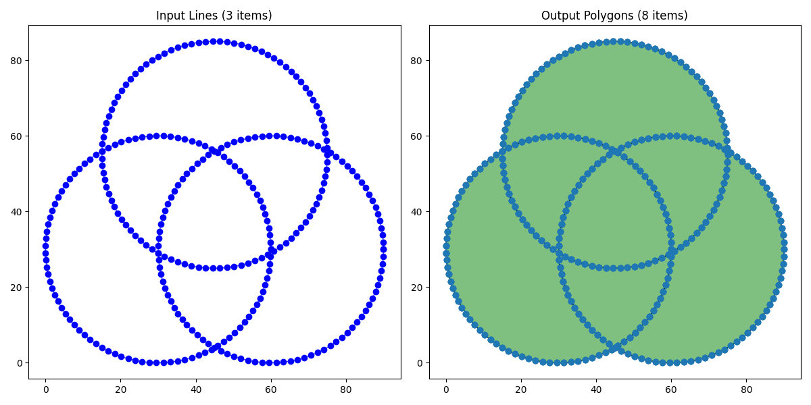
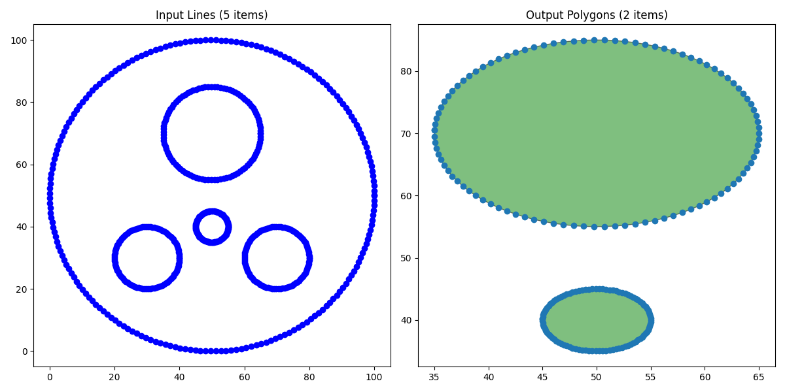

# Geo Polygonize

A native Rust port of the JTS/GEOS polygonization algorithm. This crate allows you to reconstruct valid polygons from a set of lines, including handling of complex topologies like holes, nested shells, and disconnected components.

[](https://deepwiki.com/graydonpleasants/geo-polygonize)

## Features

- **Robust Polygonization**: Extracts polygons from unstructured linework.
- **Robust Noding**: Implements **Iterated Snap Rounding (ISR)** to guarantee topological correctness on dirty inputs (self-intersections, overlaps).
- **Hardware Acceleration**: Uses **SIMD** instructions (via `wide` crate) for critical geometric predicates like Point-in-Polygon checks.
- **Wasm Optimized**: Tailored for WebAssembly with `talc` allocator and Zero-Copy data support (`geoarrow`).
- **Performance**: Competitive with GEOS/Shapely (C++), outperforming it on random sparse inputs and scaling well on dense grids.
- **Geo Ecosystem**: Fully integrated with `geo-types` and `geo` crates.
- **GeoArrow Support**: Zero-copy data transfer via Arrow C Data Interface and Arrow IPC (Wasm).

## Engineering Roadmap

For an ambitious, prioritized plan covering performance, security, API consistency, and maintainability, see [docs/roadmap.md](docs/roadmap.md).

## Usage

### Library

```rust
use geo_polygonize_core::Polygonizer;
use geo_types::LineString;

fn main() {
    let mut poly = Polygonizer::new();

    // Enable robust noding if lines might intersect
    poly.node_input = true;
    // Optional: Configure snap grid (default 1e-10)
    poly.snap_grid_size = 1e-6;

    // Add lines (e.g., a square with diagonals)
    poly.add_geometry(LineString::from(vec![
        (0.0, 0.0), (10.0, 0.0), (10.0, 10.0), (0.0, 10.0), (0.0, 0.0)
    ]).into());
    poly.add_geometry(LineString::from(vec![
        (0.0, 0.0), (10.0, 10.0)
    ]).into());

    let polygons = poly.polygonize().expect("Polygonization failed");

    for p in polygons {
        println!("Found polygon with area: {}", p.unsigned_area());
    }
}
```

### Choosing `node_input` and `snap_grid_size`

Polygonization quality is heavily influenced by input noding strategy.

- **`node_input = false`** (default): Fastest path. Use this when your input linework is already noded (all intersections are explicit vertices).
- **`node_input = true`**: Enables Iterated Snap Rounding (ISR). Use this for real-world datasets that may contain slight misalignments, overlaps, or self-intersections.
- **`snap_grid_size`** controls how aggressively coordinates are snapped during robust noding:
  - Start with `1e-10` for high-precision projected data.
  - Increase to `1e-8` or `1e-6` when near-duplicate vertices prevent clean topology.
  - Avoid very large values unless your coordinate units are coarse; oversnapping can collapse narrow features.

Practical workflow:
1. Run with `node_input = false` first on trusted data.
2. If you observe missing polygons, sliver artifacts, or unresolved intersections, enable `node_input`.
3. Tune `snap_grid_size` upward incrementally until topology stabilizes.

### Output semantics

The polygonizer intentionally returns only valid polygonal areas that can be formed from closed cycles:

- **Dangles are removed**: dead-end edges do not appear in output polygons.
- **Cut edges are excluded**: edges that are connected but cannot bound a face are ignored.
- **Holes and nested shells are preserved** when enough boundary information is present.

This behavior matches classical JTS/GEOS polygonization semantics and is useful for cleaning linework before area analysis.

### GeoArrow Integration

The library supports ingesting data directly from Arrow arrays via the `arrow_api` module and `ffi`.

```rust
use geo_polygonize_core::arrow_api::{polygonize_arrow, PolygonizerOptions};
// ... create Arrow array ...
// let result = polygonize_arrow(&array, &field, options);
```

### Python

The Python package is published as `geo-polygonize-py` and imported as `geo_polygonize`.

```bash
pip install geo-polygonize-py
```

```python
import numpy as np
from geo_polygonize import polygonize, import_probe

# 1. Using Shapely LineStrings or coordinate lists directly
lines = [
    [(0, 0), (10, 0), (10, 10), (0, 10), (0, 0)],
    [(0, 0), (10, 10)]
]

# return_polygons=True returns a list of shapely.geometry.Polygon objects
polygons = polygonize(lines=lines, return_polygons=True)
for p in polygons:
    print(p.area)

# 2. Using High-Performance Flat Arrays
# Perfect for zero-copy integrations or massive datasets
coords = np.array([
    0.0, 0.0, 10.0, 0.0, 10.0, 10.0, 0.0, 10.0, 0.0, 0.0,
    0.0, 0.0, 10.0, 10.0
], dtype=np.float64)

# Start indices for each line segment.
# The final closing offset is computed implicitly.
offsets = np.array([0, 5], dtype=np.uint32)

# Returns a stable dictionary with 'polygons', diagnostics, and provenance.
result_dict = polygonize(coords=coords, offsets=offsets)

# Native-extension probes are cheap and safe for optional integrations.
ok, error = import_probe()
```

CFB/autograder integrations should use the versioned production profile rather
than assembling caller-side knobs or using legacy `polygonize(..., node=True,
snap=0.5)` calls:

```python
from geo_polygonize import cfb_robust_options, polygonize_with_options

result = polygonize_with_options(
    coords=coords,
    offsets=offsets,
    options=cfb_robust_options(),
)
```

The default return shape is a stable dictionary with `polygons` as
`SimplePolygon` values. Use `return_polygons=True` only when you want Shapely
`Polygon` objects.

`SnapStrategy::Grid` keeps topology and output coordinates on the configured
precision grid. The CFB profile uses `GeosCompat`: the grid establishes robust
topology, then output nodes regain deterministic source coordinates to better
match Shapely `snap` plus full-precision noding. It is not `set_precision`
emulation, and exact parity is not guaranteed for many-to-one snaps.

For Shapely parity checks, compare report-mode outputs with the built-in
mismatch helper:

```python
from geo_polygonize import explain_mismatch, polygonize_with_options

options = cfb_robust_options()
result_a = polygonize_with_options(coords=coords_a, offsets=offsets_a, options=options)
result_b = polygonize_with_options(coords=coords_b, offsets=offsets_b, options=options)
result_a["options"] = options
result_b["options"] = options

mismatch = explain_mismatch(result_a, result_b)
```

For a minimal Shapely smoke comparison, use area signatures:

```python
from shapely.ops import polygonize as shapely_polygonize

rust_polys = polygonize_with_options(lines=lines, options=cfb_robust_options(), return_polygons=True)
rust_areas = sorted(round(poly.area, 6) for poly in rust_polys)
shapely_areas = sorted(round(poly.area, 6) for poly in shapely_polygonize(lines))
```

### WebAssembly (WASM)

This library supports WebAssembly with an ergonomic dual-build configuration that automatically utilizes SIMD instructions where available.

**Installation:**
```bash
npm install geo-polygonize
```

**Standard Usage (Quick Demos):**
The default entry point automatically handles feature detection (SIMD) and lazy-loading of the Wasm binary. The Wasm is inlined as a Base64 Data URI, so no extra bundler configuration is needed. For app builds, prefer the slim entry point below so your bundler keeps the Wasm assets out of the JavaScript chunk.

```javascript
import init, { polygonize, polygonize_geoarrow } from "geo-polygonize";

async function run() {
    await init();

    const geojson = {
        "type": "FeatureCollection",
        "features": [
            // ... your line features
        ]
    };

    // Returns a GeoJSON FeatureCollection string
    // Pass explicitly matching backend configuration if desired
    const result = polygonize(
        JSON.stringify(geojson),
        true, // node_input
        0.5   // snap_grid_size
    );
    console.log(JSON.parse(result));

    // Or use Arrow IPC bytes
    // const ipcBuffer = ...;
    // const arrowResult = polygonize_geoarrow(ipcBuffer, false, 1e-10, false);
}
```

**Slim Usage (Apps / Manual Loading):**
For Vite and other app bundlers, import from `geo-polygonize/slim` and pass explicit Wasm asset URLs.

```javascript
import { cfbRobustOptions, initBest } from "geo-polygonize/slim";
import scalarUrl from "geo-polygonize/geo_polygonize.wasm?url";
import simdUrl from "geo-polygonize/geo_polygonize_simd.wasm?url";

async function run() {
    const wasm = await initBest(
        { module_or_path: scalarUrl },
        { module_or_path: simdUrl },
    );

    const result = wasm.polygonizeWithOptions(
        JSON.stringify(geojson),
        cfbRobustOptions,
    );
}
```

**Multithreaded Usage (Experimental):**
This library provides a multithreaded build powered by `wasm-bindgen-rayon`.

```javascript
import init, { initThreadPool, polygonize } from "geo-polygonize/threads";

async function run() {
    await init();

    // Initialize thread pool (e.g., with navigator.hardwareConcurrency)
    await initThreadPool(navigator.hardwareConcurrency);

    // ... use polygonize as usual
}
```

**Important:** Multithreaded WebAssembly requires `SharedArrayBuffer`, which is only available in secure contexts. You **must** serve your page with the following headers:
```
Cross-Origin-Opener-Policy: same-origin
Cross-Origin-Embedder-Policy: require-corp
```

### CLI Example

The repository includes a CLI tool to polygonize GeoJSON files.

```bash
# Build the example
cargo build -p geo-polygonize-core --example polygonize --release

# Run on input lines
cargo run -p geo-polygonize-core --release --example polygonize -- --input lines.geojson --output polygons.geojson --node
```

### Visualization

You can visualize the results using the provided Python script (requires `matplotlib` and `shapely`).

```bash
python3 scripts/visualize.py --input lines.geojson --output polygons.geojson --save result.png
```

## Examples

Below are some examples of what the polygonizer can do.

### Nested Holes and Islands

The algorithm correctly identifies nested structures (Island inside a Hole inside a Shell).



### Incomplete Grid / Dangles

The algorithm prunes dangles (dead-end lines) and extracts only closed cycles.



### Touching Polygons (Shared Edges)

Using robust noding (`--node`), it can reconstruct adjacent polygons that share boundaries, even if the input lines are not perfectly noded.



### Self-Intersecting Geometry (Bowtie)

Self-intersecting lines are split at intersection points, and valid cycles are extracted.



### Complex Geometries

The polygonizer can handle complex, curved inputs (approximated by LineStrings) such as overlapping circles and shapes with multiple holes.

**Overlapping Circles**: Note how the intersection regions are correctly identified as separate polygons.



**Curved Holes**: A complex polygon with multiple circular holes.



## Benchmarks

This library includes a "severe" comparison suite against `shapely` (GEOS).

See [BENCHMARKS.md](BENCHMARKS.md) for detailed results and instructions on how to run them.

## Architecture

This implementation moves away from the pointer-based graph structures of JTS/GEOS to a Rust-idiomatic Index Graph (Arena) approach.

See [ARCHITECTURE.md](ARCHITECTURE.md) for a deep dive into the optimization strategies.

Key optimizations include:
1.  **Robust Noding**: Iterated Snap Rounding (ISR) using `rstar` for intersection detection and grid snapping.
2.  **Vectorization**: SIMD-accelerated Ray Casting for efficient Hole Assignment.
3.  **Memory Layout**: Structure of Arrays (SoA) for graph nodes and `talc` allocator for Wasm.

## License

MIT/Apache-2.0
